.. _gui:

Graphical User Interface (GUI)
========================

detailed documentation to come

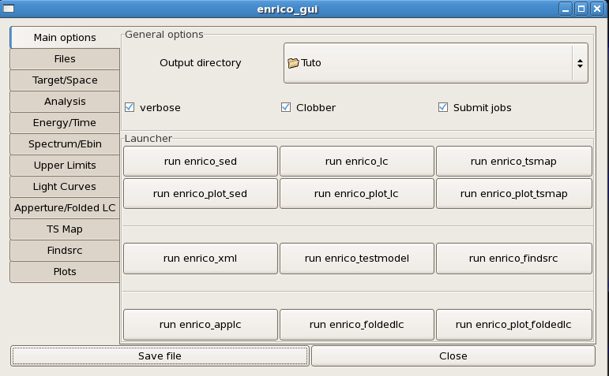

   Main page of the GUI

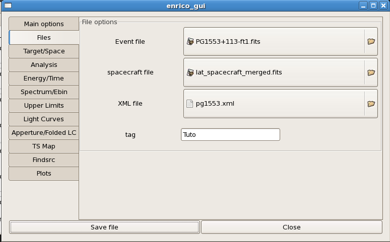

   File page of the GUI

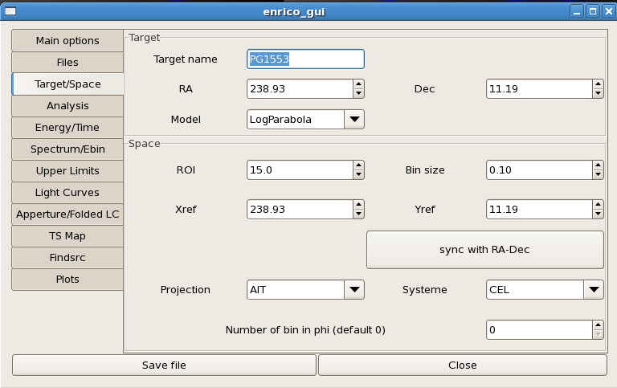

   Target and Space pages of the GUI

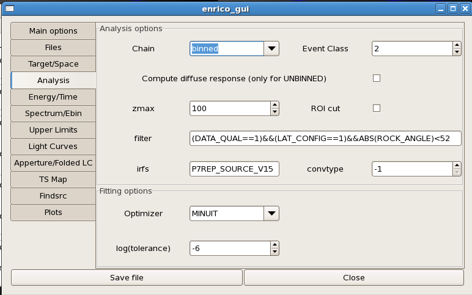

   Analysis page of the GUI

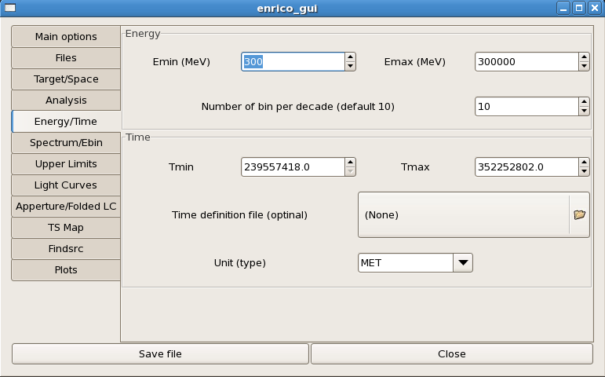

   Energy and Time page of the GUI

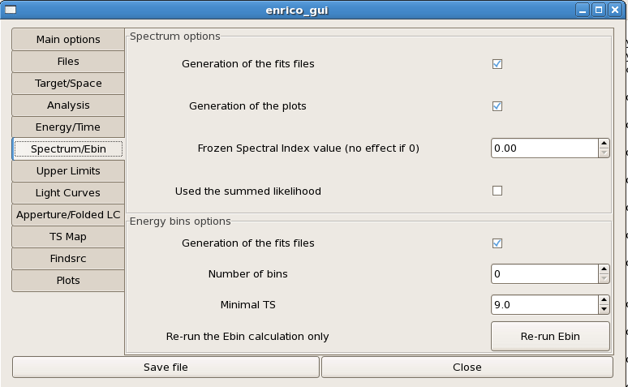

   Spectrum page of the GUI

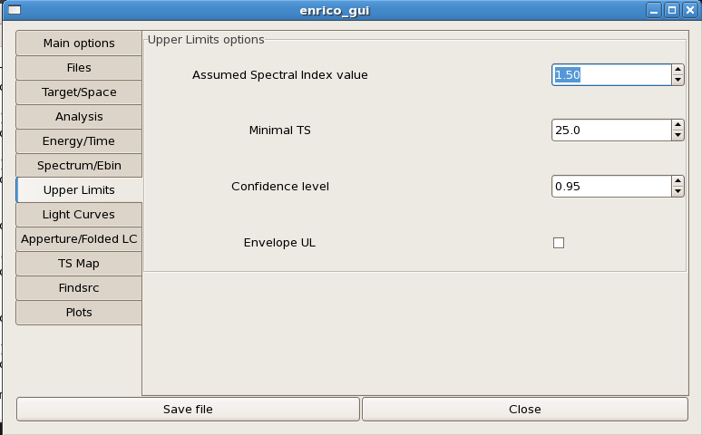

   Upper limits page of the GUI

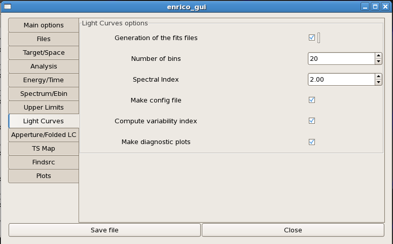

   Light curves page of the GUI

   Light curves page of the GUI

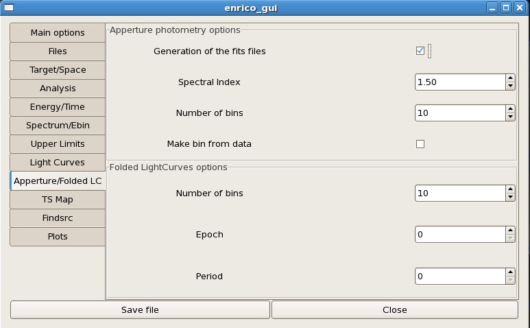

   Aperture and Folded Light curves page of the GUI

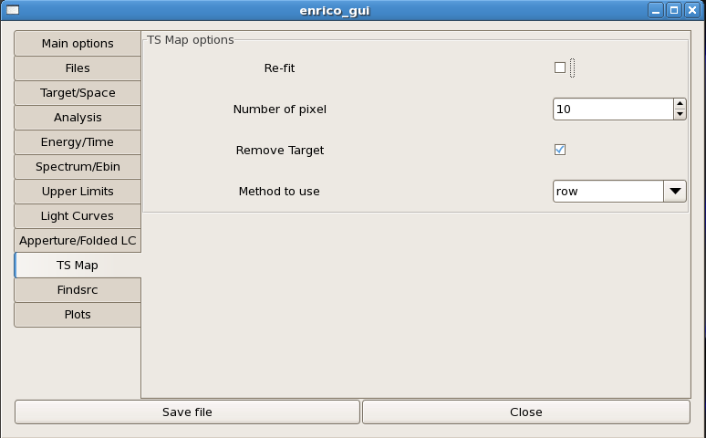

   TS Map page of the GUI

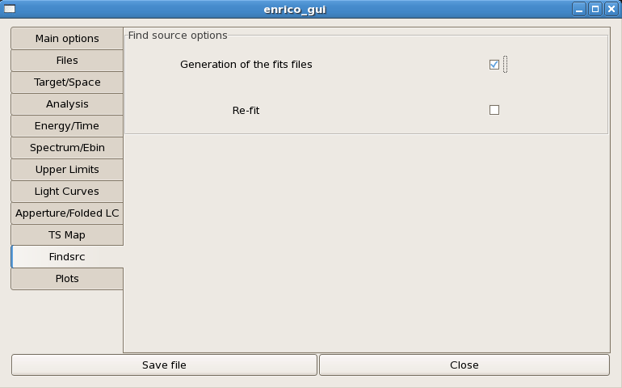

   Find source page of the GUI

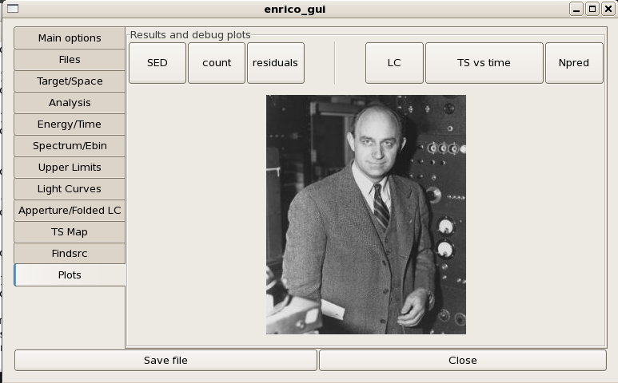

   plot page of the GUI
