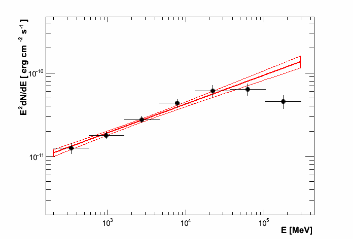
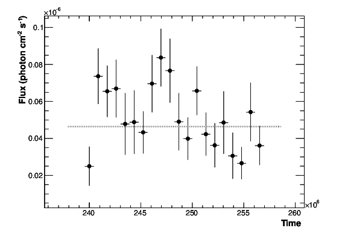
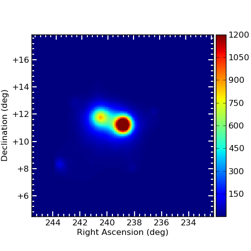
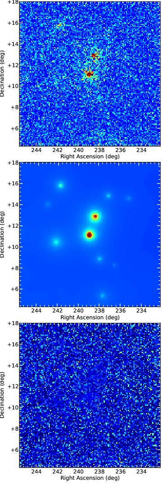
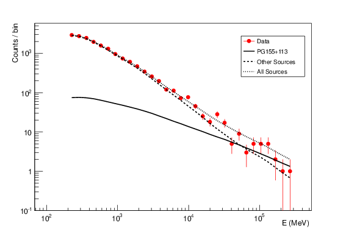
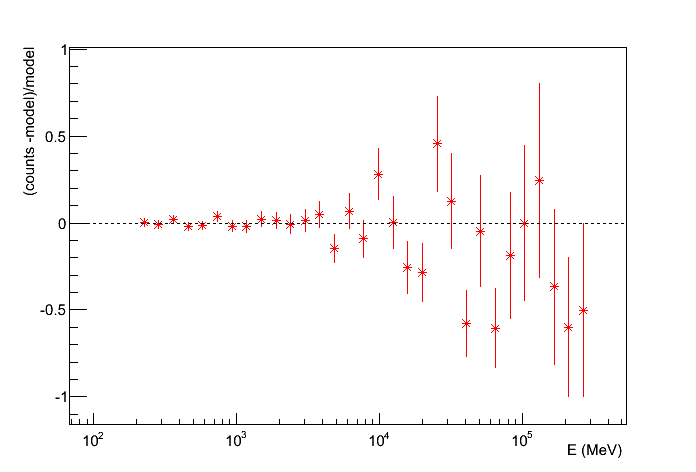
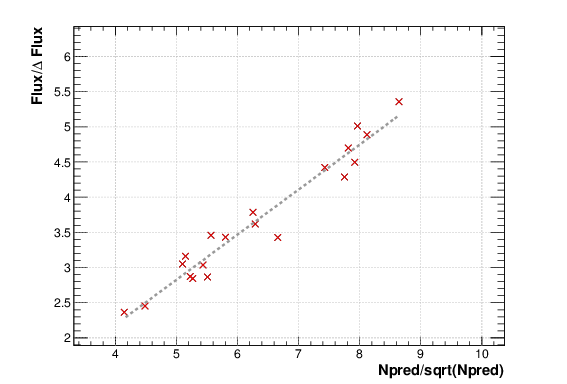

.. _tutorial:

Tutorial
========

This tutorial will walk you through the steps to repeat the analysis
of the AGN PG1553+113 done in the official `Fermi collaboration python tutorial
<http://fermi.gsfc.nasa.gov/ssc/data/analysis/scitools/python_tutorial.html>`__
and results published here.

We strongly recommend that you run this analysis once, so that you
can be sure to produce correct results before analyzing your source.

Make a new directory now where you want all of your intermediate
and final analysis results to be placed and go there. 
For illustration purposes we will assume in this tutorial this
directory is `~/myanalysis`:

.. code-block:: bash

   mkdir ~/myanalysis`~/myanalysis`
   cd ~/myanalysis

First get the data as explain the the offical page. You should have this when typing `ls`

.. code-block:: bash

   L110728114426E0D2F37E85_PH00.fits
   L110728114426E0D2F37E85_PH01.fits
   L110728114426E0D2F37E85_SC00.fits

Make an ascii will with the 'entire' path of the FT1 (PH) fits files. Let's assume this file is called  `data.list` .

Folder management
------------------

Once you have decided where the results will be placed (here `~/myanalysis`), enrico will create some subfolders to store results and files. 

 * fits files (livetime cube, selected events, etc...) will be placed in the main folder (here `~/myanalysis`)
 * The spectrum results (ascii files, plots) will be stored in a folder named Spectrum (here `~/myanalysis/Spectrum`)
 * Data (fits files) and results from the generation of energy bin will be stored in a subfolder `Ebin#` where # is the number of bins you ask for (here `~/myanalysis/Ebin#`).
 * Data (fits files) and results  generated for the light curve will be placed in `Lightcurve#`  where # is the number of bins you ask for (here `~/myanalysis/Lightcurve#`).
 * TSmap data will be placed in a TSmap subfolder  (here `~/myanalysis/TSmap`).

Make a config file
------------------

enrico uses configuration file to run analysis. The way it has been thought, you
need only one configuration file per analysis. The drawback is that such file
can be complicated to generated by hand or to understand (for a description see :ref:`configfile`).

You can use the `enrico_config` tool to quickly make a config file
called `myanalysis.conf`. It will ask you for the required options
and copy the rest from a default config file `enrico/data/config/default.conf`:

Statement enclosed in [] are default, being there to help you.

.. code-block:: bash

   $ enrico_config myanalysis.conf
   Please provide the following required options [default] :
   Output directory [~/myanalysis] :
   Target Name : PG155+113
   Right Ascension: 238.92935
   Declination: 11.190102
   Options are : PowerLaw, PowerLaw2, LogParabola, PLExpCutoff
   Spectral Model [PowerLaw] : PowerLaw2
   ROI Size [15] : 10
   FT2 file [~/myanalysis/spacecraft.fits] : ~/myanalysis/L110728114426E0D2F37E85_SC00.fits
   FT1 list of files [~/myanalysis/events.lis] : ~/myanalysis/data.list
   tag [LAT_Analysis] : TestOfPG1553
   Start time [239557418] : 239557417
   End time [334165418] : 256970880
   Emin [100] : 200
   Emax [300000] : 

Note :

* Always give the full path for the files
* We used the PowerLaw2 model as in the Fermi tutorial.
* Time is give in MET
* Energy is given in MeV
* ROI size is given in degrees

Now you can edit this config file by hand to make further adjustments. For more informations about the configuration file see :ref:`configfile`

.. note:: 
   If you know exactly how the analysis steps work you can also make
   adjustments later on. But we have not put in a gadzillion of
   checks for each step to make sure that parameters are consistent
   with previous steps, so it is best to only adjust parameters
   at the beginning.

Make a model xml file
---------------------

The ST works using an sky model written in xml format. Often, this model is
complicated to generate. You can run enrico_xml to make such model of the sky
and store it into a xml file which will be used for the analysis.

.. code-block:: bash

   $ enrico_xml myanalysis.conf 
   use the default location of the catalog
   use the default catalog
   Use the catalog :  /CATALOG_PATH/gll_psc_v06.fit
   Add  12  sources in the ROI of  10.0  degrees
   3  sources have free parameters inside  3.0  degrees
   write the Xml file in  ~/myanalysis/PG155+113_PowerLaw2_model.xml

.. note:: 
   Note that you give options for this step simply by mentioning
   the config file. For the `enrico_xml` tool, the relevant options
   are in the [space], [target] section.  The out file is given by [file]/xml.

Get data
--------

There are two possibilities:

* Download data by hand for this target.
* Use the weekly generated fits file available on the web

Run global fit
--------------

The gtlike tool implemented in the ST find the best-fit parameters by minimizing a likelihood function. Before running gtlike, the user must generate some intermediary files by using different tools. With enrico, all those steps are merged in one tool. To run the global fit just call :

.. code-block:: bash

   $ enrico_sed myanalysis.conf 

This will make all the steps for you (gtselect, gtmktime,gtltcube, etc...), produce all the required fits files and fit the data (gtlike). A file with the extension 'results' will be produced and where all the results will be stored.

If you want to refit the data because e.g. you changed the xml model, you are
not force to regenerate the fits file. Only the gtlike tool should be recall.
This is also possible with enrico. By changing the option
[spectrum]/FitsGeneration from yes to no, enrico will be told to not generate
the fits files and directly proceed to the fit.

if the found TS is below the value set in [UpperLimit]/TSlimit, then an upper limit is computed.

.. note:: 
   For the `enrico_sed` tool, most of the relevant options in the [spectrum] section

You can use `enrico_testmodel` to compute the log(likelihood) of the models `POWERLAW`, `LogParabola` and `PLExpCutoff`. An ascii file is then produced in the Spectrum folder with the value of the log(likelihood) for each model. You can then use the Wilk's theorem to decide which model best describe the data.

Make flux points
----------------

Often, an SED is presented with point obtained by restricting the energy range
and re-run a complete analysis.

To make flux points, again `enrico_sed` tool will be used. It will first run a global fit (see previous section) and if the option [Ebin]/NumEnergyBins is greater than 0, then at the end of the overall fit, enrico will run NumEnergyBins analysis by dividing the energy range.

Each analysis is the a proper analysis (it runs gtselect, gtmktime,gtltcube,..., gtlike), run by the same enrico tool than the full energy range analysis. If the TS found in the time bins is below [Ebin]/TSEnergyBins then an upper limits is computed.

.. note:: 
   If a bin failed for some reason or the results are not good, you can rerun the analysis of the bin by calling `enrico_sed` and the config file of the bin (named SOURCE\_NumBin.conf and in the subfolder Ebin#). 

.. note:: 
   Most of the relevant options in the [Ebin] section.

Make a light curve
------------------

A light curve is obtained by run the entire analysis chain into time bins. To make a light curve

.. code-block:: bash

   $ enrico_lc myanalysis.conf 

It will divide the time range in [LightCurve]/NLCbin bins and run a proper analysis. If the TS found in the time bins is below [LightCurve]/TSLightCurve then an upper limits is computed.

.. note:: 
   Note that you give options for this step simply by mentioning the config file.
   For the `enrico_lc` tool, most of the relevant options are in the [LightCurve]
   section

Make a TS map
-------------

TS map are use to find new source in a ROI. They are produced by adding a spurious source on each point of a grid (pixel) and computing the TS of this source.

You can make a TS map using the tool `enrico_tsmap`. It will compute the TS in each bin of the ROI. You must have run `enrico_sed` before.

.. note::

  This binning is based on the count map produced during the fit of the full
  energy range `enrico_sed`. The division of the ROI controlled by the option
  [space]/npix and [space]/npiy but cannot be change after having run
  `enrico_sed`.

In order to speed up the process, parallel computation can be used. Either each pixel can be a job by itself (option [TSMap]/method = pixel) or a job can regroup an entire row of pixel (option [TSMap]/method = row)

If you want of remove the source your are interested in from the TS map (i.e. froze its parameters to the best fit values) use [TSMap]/RemoveTarget = yes.

.. note:: 
   For the `enrico_tsmap` tool, most of the relevant options are in the [TSMap]
   section

It can happend that some job failed of the obtain TS is not good (due to convergence problems) If a pixel (or a row) has failed, you can rerun it.

To re-run a single pixel, i.e. the pixel (49,4) :

.. code-block:: ini

   enrico_tsmap myanalysis.conf 49 4

To re-run a row, ie row number 49 :

.. code-block:: ini

   enrico_tsmap myanalysis.conf 49

Upper Limits
-------------

An upper limits is calculated if the Test Statistic (TS) of the source is below a certain limit set by the user. To set this limit for :

 * `enrico_sed`, use the option [UpperLimits]/TSlimit. 
 * bins in energy, use the option [Ebin]/TSEnergyBins. 
 * `enrico_lc`, use the option [LightCurve]/TSLightCurve. 

Two methods are available :

 * The profile method, which look for a decrease of a certain amount of the likelihood function
 * The integral method which compute the integral of the  likelihood function as a function of a parameter to set the UL

Both implementations are provided by the ScienceTools and used by enrico.

.. note:: 
   For upper limits, most of the relevant options are in the [UpperLimits]
   section

Plot results
-------------

Now, we want to plot the results of the analysis we performed. Some plots can be produced by enrico. Using the tools `enrico_plot_*` allow to plot the results of your analysis.

The 1 sigma contour plot can be computed by `enrico_sed` if the option [Spectrum]/ResultPlots=yes. Then to plot it, call `enrico_plot_sed myanalysis.conf` which will make a SED with the 1 sigma contour and add the data points computed previously (section `Make flux points`).

   SED of PG 1553+113

If you ran a binned analysis and with the option [Spectrum]/ResultPlots=yes then a model map is produced to compare with the real count map (see the section check results).

 * The light curve can be plotted using  `enrico_plot_lc myanalysis.conf` as well as diagnostic plot (TS vs time, Npred vs time, etc...)

.. code-block:: bash

   Chi2 =  33.4499766302  NDF =  19
   probability of being cst =  0.0213192240717

    Fvar =  0.17999761777  +/-  0.089820202452

   Light curve of PG 1553+113. The dashed gray line is the results of a fit with a constant.

enrico also computes the variability index as described in the 2FGL catalog (see `here <http://fermi.gsfc.nasa.gov/ssc/data/access/lat/2yr_catalog/>`__).

 * The TS map (see the section `Make a TS map`) can be plotted and save in a fits file using  `enrico_plot_tsmap myanalysis.conf`. This will generate a fits file that can be plotted using the script `plotTSmap.py`

   TS Map of PG 1553+113.

Check results
-------------

There is different way to check the quality of a results. First have a look the log file and loff for any error or warning messages. Enrico also produce maps that can use to check the results

`Spectrum`

 * counts map, model map and subtract map. 

   Maps of  PG 1553+113, from top to bottom: counts map, model map, residuals map.

These maps are use to visualize the ROI and check and see any misfitted sources. You can plot then using the script 'plotMaps.py'

 * Counts Plot and Residuals. The points  (# counts/bin) are the data, and the solide line  is the source model. Dashed line is the sum of all other model and dotted line is the sum of both. Error bars on the points represent sqrt(Nobs) in that band, where Nobs is the observed number of counts. The Residuals are computed between the sum model and the data.

   Count plot of PG 1553+113

   Residuals plot of PG 1553+113

`Light-curves`

 * The generation of light-curves might suffer from troubles, especially in the error bars computation. To check this, enrico plots the flux/dflux vs Npred/DNpred. If the errors are well computed the two variables are highly correlated.

   flux/dflux vs Npred/DNpred plot of PG 1553+113. Red points are time-bins with TS> TSlimit, black (if any) are point for which an upper-limits on the flux was calculated and the points can be safely ignored in this plot. The gray dashed line is the fit with a linear function. to guide the eyes.
